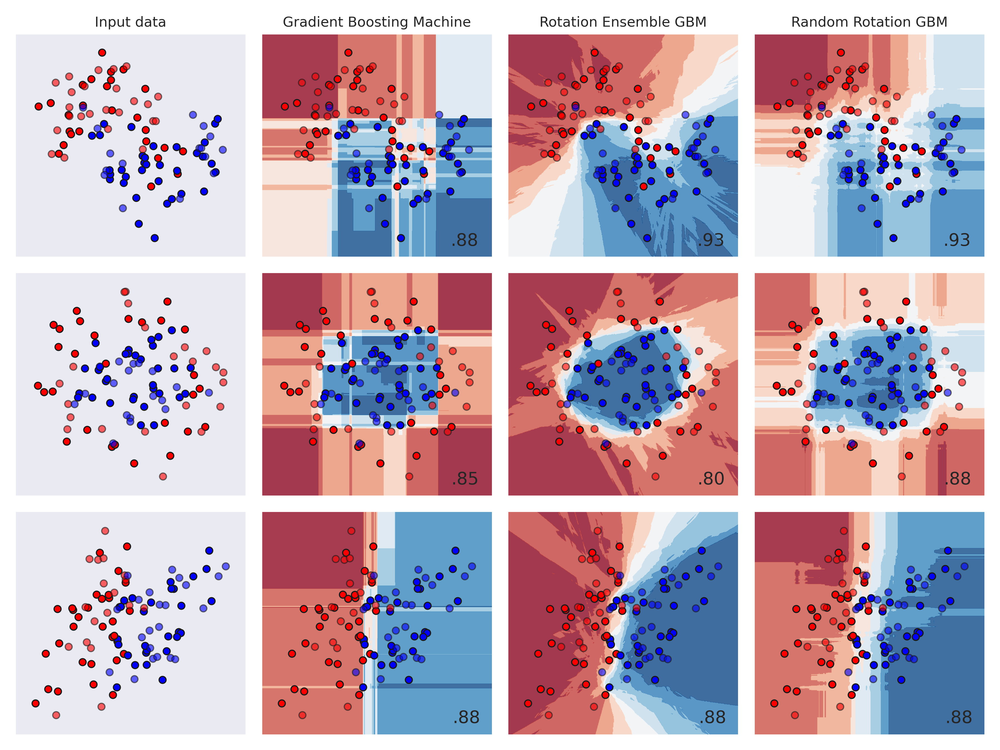

# random-rotation-random-forests
Random Rotation Random Forests proposed in [this paper](https://jmlr.org/papers/volume17/blaser16a/blaser16a.pdf) implemented using ``sklearn``'s Random Forests classes.

## Effect on decision boundaries and performance
Below is a demonstration of decision boundaries for vanilla Random Forests and Random Rotation Random Forests. Both models were trained with parameters ``max_depth=4``, ``n_estimators=200`` and ``max_features=1``.


Gradient Boosting Machines can also benefit from random rotations. Here vanilla GBM was trained with parameters ``max_depth=4``, ``n_estimators=200``, ``max_features=1`` and rotated version is an ensemble of ``40`` different GBM each with unique random rotated with the following hyperparameters: ``max_depth=4``, ``n_estimators=5``, ``max_features=1``. Resulting ensemble consists of ``200 (40 x 5)`` unique trees.


## Usage example
 ``` python
from rrsklearn import RRRandomForestClassifier
from sklearn.datasets import make_moons
from sklearn.model_selection import train_test_split
from sklearn.preprocessing import StandardScaler


# Generate sample data
X, y = make_moons(n_samples=250, noise=0.1)
X_train, X_test, y_train, y_test = train_test_split(X, y, test_size=0.3)
# Standardize data
X_train, X_test = [StandardScaler().fit_transform(x) for x in (X_train, X_test)]
# Fit RRRF
rrrf = RRRandomForestClassifier(n_estimators=200, max_depth=2)
rrrf.fit(X_train, y_train)
# Score on testing set
rrrf.score(X_test, y_test)
 ```

Example of using RandomRotation tranformer for GBM ensembles:
``` python
from rrsklearn import RandomRotation
from sklearn.ensemble import GradientBoostingClassifier
from sklearn.ensemble import VotingClassifier
from sklearn.pipeline import make_pipeline

rrgbm = VotingClassifier(
    [(f'gbm{i}', make_pipeline(
            RandomRotation(),
            GradientBoostingClassifier(max_depth=4, n_estimators=5, max_features=1)
        )
    ) for i in range(40)], 
    voting='soft'
)
```

